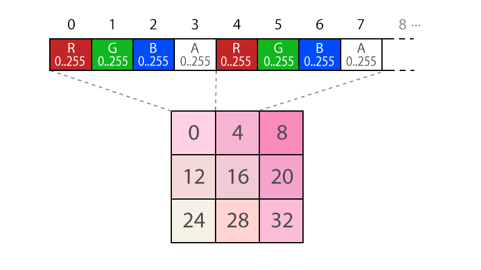

[](https://app.netlify.com/sites/sayancr777-spark-filter/deploys)

### Usage

Import an image object to `filterous` and render as HTML with `renderHtml`.

```javascript
filterous.importImage(imgObj, options)
  .applyFilter(filter, value)
  .renderHtml(imageDOM);
```
also:

```javascript
filterous.importImage(imgObj, options)
  .applyInstaFilter(filterName)
  .renderHtml(imageDOM);
```


```javascript
var imageDOM = document.querySelector('img.photo');
var imgObj = new Image();
imgObj.src = 'input/leia.jpg';

filterous.importImage(imgObj, options)
  .applyFilter('brightness', 0.2)
  .applyFilter('contrast', -0.3)
  .renderHtml(imageDOM);
```
Example with predefined Instagram-like effects:

```javascript
filterous.importImage(imgObj, options)
  .applyInstaFilter(filterButton.id)
  .renderHtml(imageDOM);
```

## Available Filter Effects and the Values

Most effects take a value (the amount of the effects) between -1 and 1. 
for example, the value for the `brightness()` 0 means unchanged, -1 darkens the image, and 1 means full-brightness. The image will turn almost completely white.


| Effect        | Adjestment(s)                   |
| ------------- | ------------------------------- |
| `grayscale`   | N/A                             |
| `sepia`       | 0 to 1                          |
| `invert`      | N/A                             |
| `brightness`  | -1 to 1                         |
| `saturation`  | -1 to 1                         |
| `contrast`    | -1 to 1                         |
| `rgbAdjust`   | [r, g, b]                       |
| `colorFilter` | [r, g, b, adj] // adj is 0 to 1 |
| `convolute`   | 3x3 matrix                      |


## Available InstaFilter Names

| Names    |           |           |         |          |           |
| -------- | --------- | --------- | ------- | -------- | --------- |
| normal   | clarendon | gingham   | moon    | lark     | reyes     |
| juno     | slumber   | crema     | ludwig  | aden     | perpetua  |
| amaro    | mayfair   | rise      | hudson  | valencia | xpro2     |
| sierra   | willow    | lofi      | inkwell | hefe     | nashville |
| stinson  | vesper    | earlybird | brannan | sutro    | toaster   |
| walden   | 1977      | kelvin    | maven   | ginza    | skyline   |
| dogpatch | brooklyn  | helena    | ashby   | charmes  |           |

Note: `normal` gives no filter effect. It normalize the image to the original.

## Demo
[Try the demo on browser!](https://girliemac.github.io/filterous-2/demo-browser)


## Behind the Scene

Filterous takes an image into a `canvas` to manipulate the pixels of the image. Unlike the CSS filters that alters how the image appearance only on browsers, the JavaScript library actually alters the pixel color values. So you can actually download the modified image.

The `CanvasRenderingContext.getImageData()` method of the Canvas API returns an `ImageData` object representing the underlying pixel data of the canvas, and the `data` property of `pixelData` stores the color info of an each pixel in the canvas. (The diagram below shows a canvas size of only 9x9 pixel to make it simple).

Each pixel in the data array consists of 4 bytes values- red, green, blue, and alpha channel, and each of the R (red), G (green), B (blue) and A (alpha transparency) values can take values between 0 and 255.



This library alters R, G, or B values of each pixel (yes, each pixel in the entire image! so the operation can be quite slow with JavaScript!) to get filtered look.

